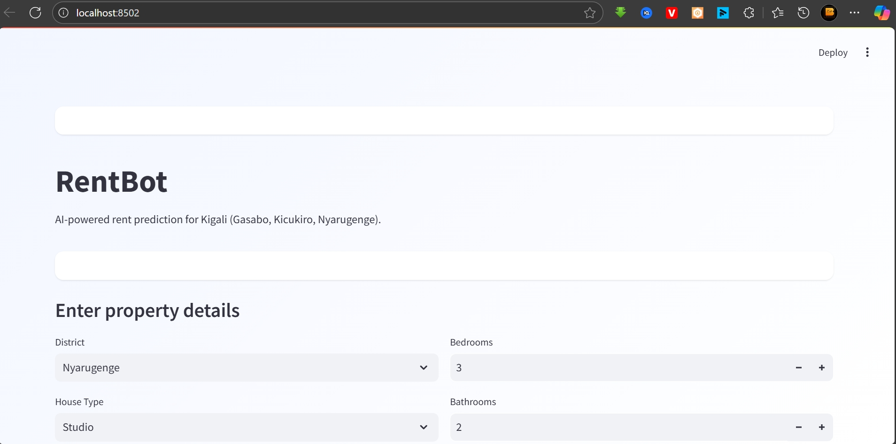
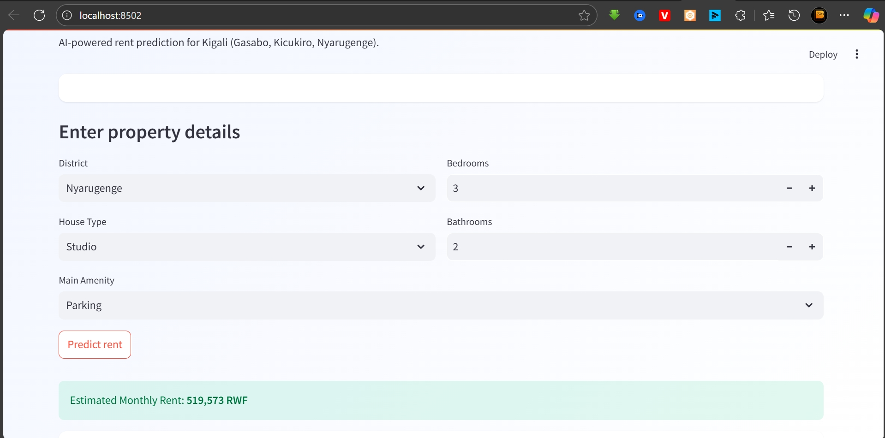
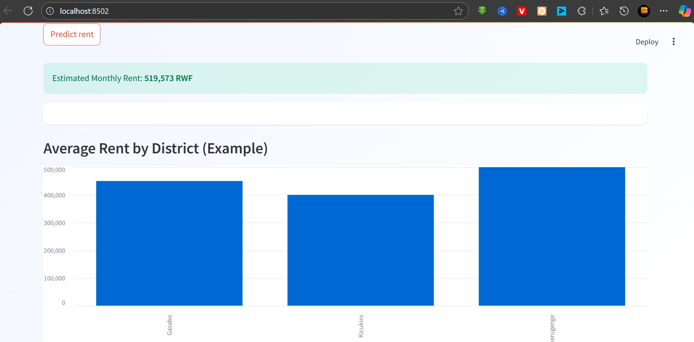

# 🏠 RentBot – AI-Powered Rent Prediction for Kigali

RentBot is a smart tool that predicts house rental prices across **Gasabo, Kicukiro, and Nyarugenge** districts in Kigali.  
It helps both tenants and property owners to get **data-driven rental price estimates** and visualize trends.

---

## **🚀 Features**
- AI-powered rent prediction based on property details (district, house type, bedrooms, bathrooms, amenities).
- **Interactive UI** built with Streamlit.
- **Bar chart** showing average rent by district.
- Clean and lightweight **machine learning model** (trained on dummy data for hackathon).
- **Real-world problem-solving**: Transparency in rent pricing for Kigali citizens.

---

## **📊 Dataset Overview**
The dataset (dummy for hackathon) includes:
- **District** (Gasabo, Kicukiro, Nyarugenge)
- **House Type** (Apartment, Bungalow, Villa)
- **Bedrooms / Bathrooms**
- **Main Amenities**
- **Rent Price (RWF)**

> **Note**: For the hackathon, we used simulated data. Future plans involve real-world data collection and retraining.

---

## **🖼️ Screenshots**
### **Homepage**


### **Prediction Form**


### **Result & Visualization**


---

## **⚡ Quick Start**

### **1. Clone Repository**
```bash
git clone https://github.com/ibrazzi-dev/RentBotProject.git
cd RentBotProject
